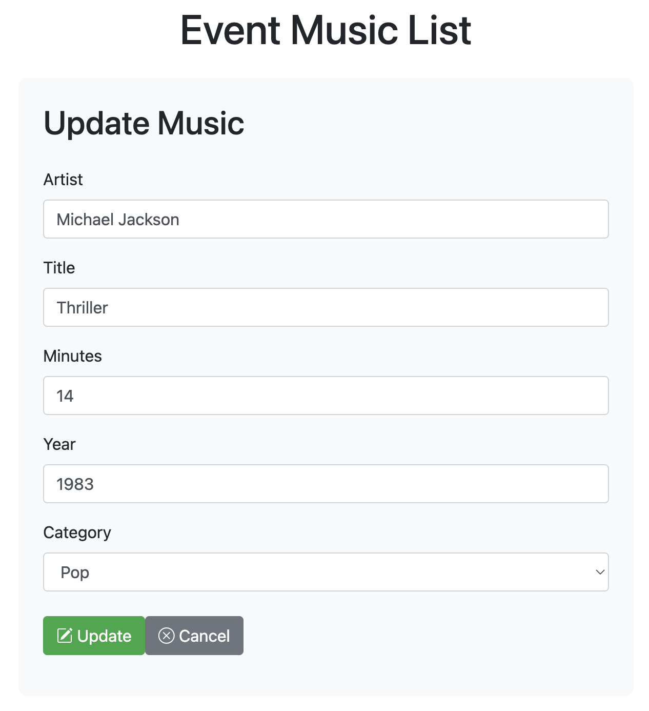

# Higher Diploma in Science in Data Analytics
*****

## Web Services and Applications Module


************

## My Assessment Repository

This repository was created as part of the Web Services and Applications assessment module for the course in the [Higher Diploma in Science in Data Analytics](https://www.atu.ie/courses/higher-diploma-in-science-data-analytics?_gl=1%2A1bcdos0%2A_ga%2AMTE3OTU2MzQ5LjE2OTY2MDYwMzE.%2A_ga_5R02GBYV8V%2AMTcxNDMzOTE2Ni4xMS4xLjE3MTQzMzkyMDAuMC4wLjA.) at [ATU](https://www.atu.ie/). This README has been written with [Github's Documentation On READMEs](https://docs.github.com/en/repositories/managing-your-repositorys-settings-and-features/customizing-your-repository/about-readmes) in mind. You can find more about [writing in Mark Down in GitHub's documentation](https://docs.github.com/en/get-started/writing-on-github/getting-started-with-writing-and-formatting-on-github/basic-writing-and-formatting-syntax).

## Getting Started

This repository contains my [Big Project](https://github.com/RodrigoDMU/WSAA_big_project) submission for the module, showcasing the skills I have developed throughout the course in Web Services and Applications.

### Big Project - Event Music List

A RESTful API built with Flask for managing a music library. It allows you to **create**, **read**, **update**, and **delete** music entries from a MySQL database.





#### Project Structure

├── musicviewer.html # Event playlist public preview page
├── server.py # Main Flask app
├── musicDAO.py # Data access logic (CRUD operations)
├── dbconfig.py # MySQL connection configuration
├── requirements.txt # Python package dependencies

#### ⚙️ Setup Instructions

##### 1. Clone the repository in Pythonanywhere
```
git clone https://github.com/RodrigoDMU/WSAA_big_project
cd WSAA_big_project```
```

##### 2. (Optional) Create a virtual environment
```
python -m venv venv
source venv/bin/activate 
```

##### 3. Install dependencies
```
pip install -r requirements.txt
```

##### 4. Set up the MySQL database
Create a MySQL database and run the following SQL:
```
CREATE TABLE music (
    id INT AUTO_INCREMENT PRIMARY KEY,
    artist VARCHAR(255) NOT NULL,
    title VARCHAR(255) NOT NULL,
    minutes INT CHECK (minutes >= 0),
    year INT CHECK (year >= 0),
    category ENUM(
        'Blues',
        'Classical',
        'Contemporary R&B',
        'Country',
        'Disco',
        'Electronic',
        'Gospel',
        'Hip Pop',
        'Jazz',
        'Pop',
        'Reggae',
        'Rock',
        'Soul Music',
        'Others'
    ) NOT NULL,
    created_at TIMESTAMP DEFAULT CURRENT_TIMESTAMP
);
```
### - Notes:
id: Auto-incremented primary key.

artist and title: Text fields, required.

minutes and year: Numeric, optional basic validation with CHECK.

category: Limited to predefined options using ENUM.

created_at: Optional, adds a timestamp of when the row was added.

##### 5. Configure database connection
Edit the file dbconfig.py with your own MySQL credentials:

```
mysql = {
    'host': "host",
    'user': "username",
    'password': "password",
    'database': "database"
}
```
##### 6. Run the application
The public playlist viewer page can be accessed at: https://rodrigodmu.pythonanywhere.com/musicviewer.html

*****

## Author

**Rodrigo De Martino Ucedo:**
 I am currently studying Higher Diploma in Science in Data Analysis at Atlantic Technological University. For more information or questions, please contact me on GitHub or add me on [LinkedIn](https://www.linkedin.com/in/rdmdemartino/).

*******
## End
last commit on 24/05/2025.